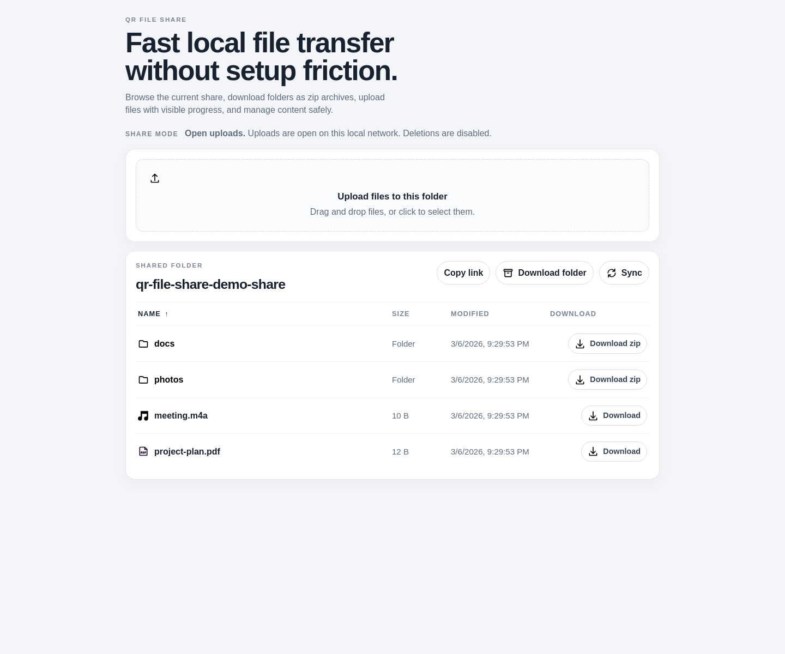
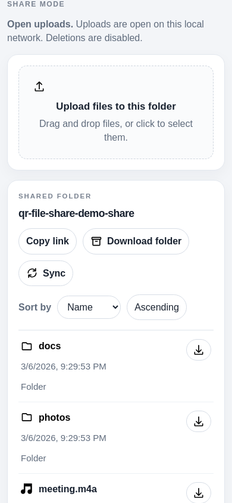
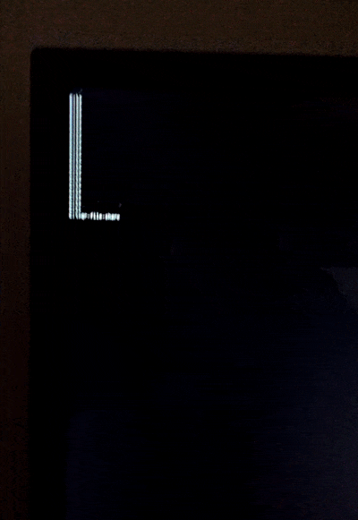

# qr-file-share

Node.js HTTP server for sharing files over a local network, with a QR code printed in the terminal so another device can open the share quickly.

## Install

Install from the repo:

```sh
git clone git@github.com:robmcelhinney/qr-file-share.git
cd qr-file-share
npm install
npm --prefix client install
```

Install the published CLI:

```sh
npm i @robmcelhinney/qr-file-share -g
```

## Usage

Devices must be on the same network.

```sh
cd /dir/to/share
qr-file-share
```

Manual examples:

```sh
node bin.js
node bin.js --path=/path/to/share
node bin.js --port=8765 --compression=9
```

The default port is `8765`.

The web UI only exposes the share name and relative folders. It no longer returns the host's absolute path to connected clients.

## Limits

The server supports a few operational guardrails through environment variables:

```sh
QR_FILE_SHARE_MAX_FILE_SIZE_BYTES=1073741824
QR_FILE_SHARE_MAX_FILES_PER_UPLOAD=32
QR_FILE_SHARE_REQUEST_TIMEOUT_MS=300000
QR_FILE_SHARE_TEMP_UPLOAD_DIR=/tmp/qr-file-share-upload
QR_FILE_SHARE_READ_ONLY=false
QR_FILE_SHARE_ENABLE_DELETE=false
QR_FILE_SHARE_SHOW_ALL_ADDRESSES=false
QR_FILE_SHARE_UPLOAD_TOKEN=
QR_FILE_SHARE_UPLOAD_TOKEN_MODE=static
```

`QR_FILE_SHARE_MAX_FILE_SIZE_BYTES` is enforced. `QR_FILE_SHARE_MAX_FILES_PER_UPLOAD` is applied by the server as a request guard on parsed uploads. `QR_FILE_SHARE_REQUEST_TIMEOUT_MS` controls the Node request timeout. `QR_FILE_SHARE_TEMP_UPLOAD_DIR` sets where upload temp files are written before they are moved into the shared folder.

The default upload limit is `1 GB`, but that is only the configured file-size cap, not a hard `/tmp` limit. If `/tmp` has enough free space, you can allow larger uploads just by increasing `QR_FILE_SHARE_MAX_FILE_SIZE_BYTES`.

Example:

```sh
QR_FILE_SHARE_MAX_FILE_SIZE_BYTES=5368709120 qr-file-share
```

That allows uploads up to `5 GB` while still using the default temp directory.

`QR_FILE_SHARE_READ_ONLY=true` disables uploads and deletions entirely. `QR_FILE_SHARE_ENABLE_DELETE=true` enables delete actions in the API and UI; by default deletes are hidden and rejected. `QR_FILE_SHARE_UPLOAD_TOKEN` enables token-gated uploads and deletions; the web UI will prompt for the token before mutating files. `QR_FILE_SHARE_UPLOAD_TOKEN_MODE=session` generates a token valid until the process restarts and prints it to the server log on startup.

By default the CLI prints one preferred LAN URL instead of every detected adapter address. Set `QR_FILE_SHARE_SHOW_ALL_ADDRESSES=true` if you want to show every interface and QR code.

If `/tmp` is too small for temporary upload storage, point `QR_FILE_SHARE_TEMP_UPLOAD_DIR` at a larger disk location.

The web UI also supports copying a shareable link to the current folder and showing the current share mode in the header. Delete actions only appear when `QR_FILE_SHARE_ENABLE_DELETE=true`.

## Development

Backend server:

```sh
npm run start-server
```

Frontend dev server with Vite:

```sh
npm --prefix client run dev
```

Production build:

```sh
npm run build-client
```

Tests:

```sh
npm test
npm run test:browser
```

`npm run test:browser` requires a Playwright Chromium install.

CI runs `npm test`, `npm --prefix client run build`, and `npm run test:browser` on every push and pull request.

## Release

See [RELEASE.md](RELEASE.md) for the publish checklist.

There is a `Release Assets` workflow that runs when a GitHub release is published and uploads:
- `qr-file-share-linux`
- `qr-file-share-macos`
- `qr-file-share-win.exe`

You can also build them locally with:

```sh
npm run build:binaries
```

The standalone executables currently use `pkg` Node 18 targets because `pkg` does not provide Node 20 base binaries.

There is also a manual GitHub Actions workflow named `Publish` that reruns tests and publishes to npm with `NPM_TOKEN`.

## Demo





## Help

```sh
qr-file-share --help
```

or

```sh
node bin.js --help
```

## Docker

Build:

```sh
docker build -t qr-file-share .
```

Run:

```sh
docker run -dp 8765:8765 --name qr-file-share --mount type=bind,source=/path/to/share,target=/target qr-file-share --path=/target
```

Open `http://localhost:8765` on the machine running the container. The container also prints QR codes for the host network addresses it can see.

## Inspiration

- https://github.com/mifi/ezshare
