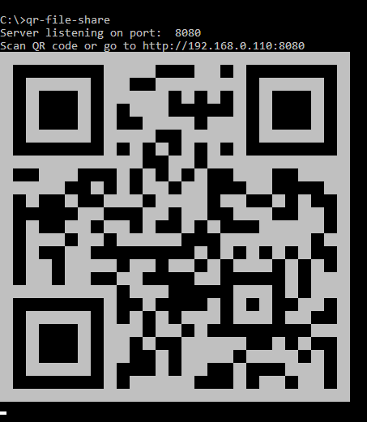
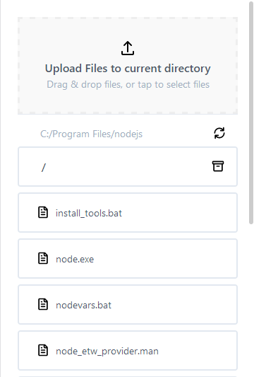

# qr-file-share
Node.js http server allowing for file transfers over local area network made easier with QR code output on start.

## Download application
[https://github.com/robmcelhinney/qr-file-share/releases](https://github.com/robmcelhinney/qr-file-share/releases)

## Install

Install from repo:

    $ git clone git@github.com:robmcelhinney/qr-file-share.git
    $ cd qr-file-share
    $ npm install

Install with npm/Node.js:

    $ npm i @robmcelhinney/qr-file-share -g

## Usage
Must be on same WiFi.

    $ cd /dir/to/share
    $ qr-file-share

Manual

	$ node bin
Call other path

	$ node bin --path=/path/to/share

## Demo

## Start & watch

    $ npm start
Open [http://localhost:8080](http://localhost:8080) to view it in the browser.
Also provides the local ip address and a qr code to view on another device on same network.

## Help
    $ qr-file-share --help
or

    $ node bin.js --help

## DOCKER
Does this need docker? Who knows? Probably not but I want to learn Docker.
The QR code links to the container's ip so it doesn't work over the local network but should work on the device running the container.

Build

	$ docker build -t qr-file-share .

Run

	$ docker run -dp 8080:8080 --name qr-file-share --mount type=bind,source=/path/to/share,target=/target qr-file-share --path=/target

## Built With
* QR Code: https://github.com/gtanner/qrcode-terminal
* Archiver: https://github.com/archiverjs/node-archiver
* Meow (CLI helper): https://www.npmjs.com/package/meow

## Inspiration
* https://github.com/mifi/ezshare
